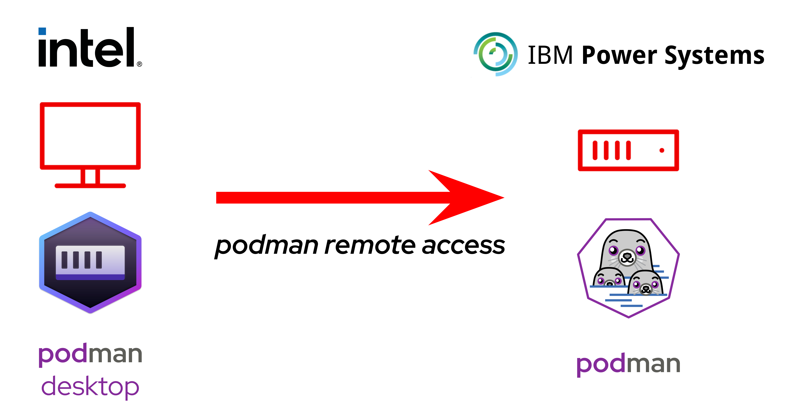

### Install `podman` and other container tools

- CLI-only tools

```
sudo dnf install container-tools
```

- GUI tools

They can be found at https://podman-desktop.io

- Use the GUI locally and connect to a remote server

See documentation at https://podman-desktop.io/docs/podman/podman-remote

The following configuration is the one being used in this demo:



### Check the `Containerfile`

Open with a text editor the file named `Containerfile` and check its content.

_NOTE_ The `Containerfile` syntaxt is fully explained at https://github.com/containers/common/blob/main/docs/Containerfile.5.md  


### Build the image on the remote machine

1. Go to _Podman Desktop_ > _Images_ > _Build_
2. Set the following parameters:
    - _Containerfile path_: `ibm_txc_24_milan/demo1_container-image/Containerfile`
    - _Build context directory_: `ibm_txc_24_milan/demo1_container-image`
    - _Image name_: `quay.io/acancell-redhat-talks/ibm_txc_24_milan/demo-container`
    - _Container engine_: `ibmpower-machine`
    - _Platform_: `PPC64LE`
3. Click _Build_
4. After the build completion, click _Done_
5. The new container image will appear in the list under _Podman Desktop_ > _Images_

### Push the image into a public repository

1. Go to _Podman Desktop_ > _Images_
2. Select the desired image
3. Click _Actions_ > _Push Image_
4. Check the _Image Tag_ and click _Push Image_
5. After the upload completion, click _Done_
6. Check the image on https://quay.io/organization/acancell-redhat-talks
7. On _quay.io_, select the image, then click _Actions_ > _Make Public_